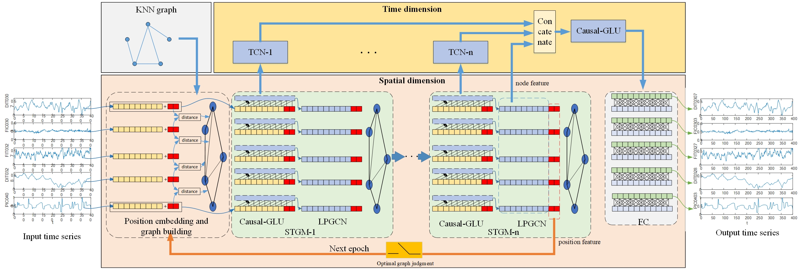

# LPGNN
Code for the paper "Multivariate Time Series Prediction of Complex Systems Based on Graph Neural Networks with Location Embedding Graph Structure Learning"



This is a Pytorch implementation.
## Requirements
- scipy>=1.7.0
- numpy>=1.21.0
- pandas>=1.2.5
- pyaml
- statsmodels
- pytorch>=1.8.0
- networkx>=2.6.3

## Data Preparation
The traffic flow dataset has been placed in the dataset folder of the code. You need to unzip the dataset to this folder first. 
METR-LA and PEMS-BAY source and original paper of [DCRNN](https://github.com/liyaguang/DCRNN). 
PEMSD4 and PEMSD8 come from the paper [ASTGCN](https://github.com/Davidham3/ASTGCN).

## Model Training

You need to first specify the dataset name in main.py and then directly to run
```bash
python main.py
```
Please wait patiently for the program to finish running.

## Result
Note: The Model is not designed for traffic flow prediction, but performs well on the traffic flow dataset.

| **Dataset**        | **METR-LA** |       |       | **PEMS-BAY** |       |       |
|--------------------|-------------|-------|-------|--------------|-------|-------|
| **Baseline**       | MAE         |MAPE(%)| RMSE  | MAE          |MAPE(%)| RMSE  |
| **STGCN**          | 4.45        | 11.8  | 8.41  | 2.49         | 5.69  | 5.79  |
| **DCRNN**          | 3.6         | 10.5  | 7.59  | 2.07         | 4.74  | 4.9   |
| **MTGNN**          | 3.49        | 9.87  | 7.23  | 1.94         | 4.53  | 4.49  |
| **GMAN**           | 3.48        | 10.1  | 7.3   | 1.86         | 4.32  | 4.31  |
| **STGNN**          | 3.49        | 9.69  | 6.94  | 1.83         | 4.15  | 4.2   |
| **GTS**            | 3.41        | 9.9   | 6.74  | 1.91         | 4.4   | 3.97  |
| **Ada-STNet**      | 3.47        | 9.8   | 7.18  | 1.89         | 4.5   | 4.36  |
| **STFGNN(SOTA)**   | 3.18        | 8.81  | 6.4   | 1.66         | 3.77  | 3.74  |
| **ours**           | 3.16        | 8.83  | 6.38  | 1.64         | 3.68  | 3.72  |
|                    |             |       |       |              |       |       |
| **Dataset**        | **PEMSD4**  |       |       | **PEMSD8**   |       |       |
| **Baseline**       | MAE         |MAPE(%)| RMSE  | MAE          |MAPE(%)| RMSE  |
| **STGCN**          | 21.16       | 13.83 | 35.69 | 17.5         | 11.29 | 27.09 |
| **DCRNN**          | 21.22       | 14.17 | 37.23 | 16.82        | 10.92 | 26.36 |
| **GraphWaveNet**   | 28.15       | 18.52 | 39.88 | 20.3         | 13.84 | 30.82 |
| **ASTGCN**         | 22.93       | 16.56 | 34.33 | 18.25        | 11.64 | 28.06 |
| **MSTGCN**         | 23.96       | 14.33 | 37.21 | 19           | 12.38 | 29.15 |
| **STSGCN**         | 21.19       | 13.9  | 33.69 | 17.13        | 10.96 | 26.86 |
| **STFGNN**         | 19.83       | 13.02 | 31.88 | 16.64        | 10.6  | 26.22 |
| **AGCRN**          | 19.83       | 12.97 | 32.3  | 15.95        | 10.09 | 25.22 |
| **Z-GCNETs**       | 19.5        | 12.78 | 31.61 | 15.76        | 10.01 | 25.11 |
| **DSTAGNN**        | 19.3        | 12.7  | 31.46 | 15.67        | 9.94  | 24.77 |
| **STG-NCDE(SOTA)** | 19.21       | 12.76 | 31.09 | 15.45        | 9.92  | 24.81 |
| **ours**           | 19.15       | 12.46 | 31.15 | 15.44        | 9.54  | 24.56 |


## Citation
Please do not repurpose our code until our paper is accepted.
